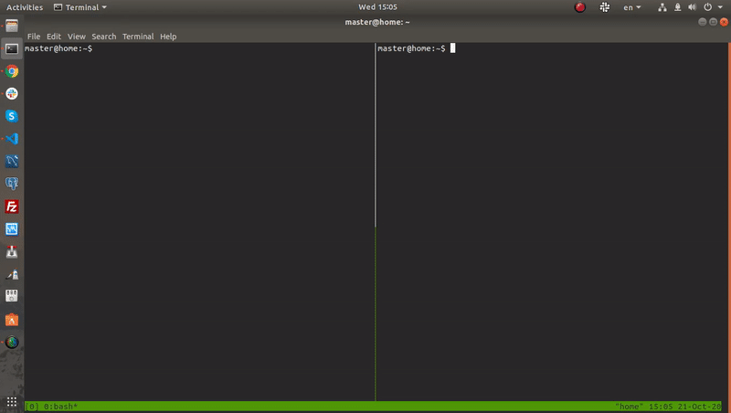

# dchelp

[](https://travis-ci.com/smokehill/dchelp)

Console tool for managing docker-compose projects.

Capabilities:
- list projects
- up and down project
- reset all active projects
- live mode
- common statistics

> The common idea of this tool is to simplify `up` and `down` actions with `docker-compose` and it doesn't track a real state of the project containers. So in any confusing situation when project id is cached but containers aren't running use `--reset` option to clear all docker units.



## Dependencies

```
docker
docker-compose
```

## Install

```
git clone https://github.com/smokehill/dchelp.git
cd dchelp/
pip install .
```

## Settings

After installation fill `~/.config/dchelp/data.json` with your projects list.

Example:
```json
[
    {
        "title": "project",
        "path": "/path/to/project/"
    }
]
```